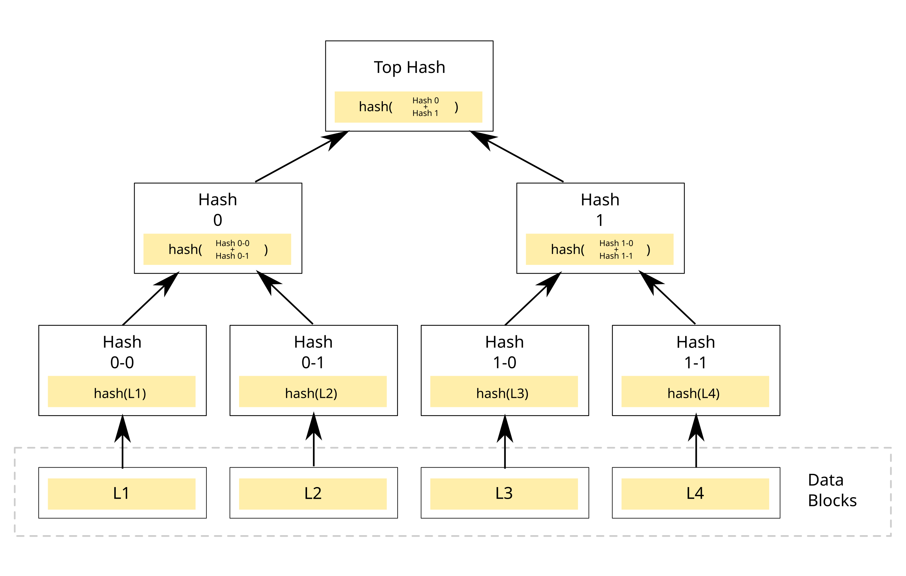

<!-- <div align="center">
    <a href="https://github.com/antontroskie" target="_blank">
        
    </a>
</div> -->

# About

This project is a Rust implementation of a Sparse Merkle Tree (SMT).

# Normal Merkle Trees
A Merkle tree or hash tree is an authenticated data structure where every leaf node of the
tree contains the cryptographic hash of a data block and every non leaf node contains the
concatenated hashes of its child nodes.

Merkle trees allow to link a set of data to a unique has value, which is very optimal and useful,
specially in blockchain technology, as it provides a secure and efficient verification of large data
sets by storing only a little piece of data on-chain.

<div align="center">
    
</div>


## Drawbacks
Merkle trees are widely used in various cryptographic and distributed systems due to their ability to efficiently verify data integrity and consistency. However, they do have some significant drawbacks:

1. Hash Recomputations: When a leaf node (or data block) is updated, all hashes along the path from that leaf to the root need to be recomputed. This involves recalculating the hash for every parent node up to the root, which can be computationally expensive, especially for deep trees with many layers.

2. Frequent Updates: In dynamic systems where data changes frequently, the cost of updating the Merkle tree can become a bottleneck, as each change propagates up the tree.


# Sparse Merkle Trees

A Sparse Merkle Tree (SMT) is a specialized version of a Merkle tree designed for handling large datasets with sparse (or infrequent) changes more efficiently. It uses the same cryptographic hash-based structure as a regular Merkle tree but is optimized to deal with specific scenarios where the dataset is large, but only a small portion of it is actively updated or queried.

## Key Characteristics of Sparse Merkle Trees

1. **Fixed Depth:**
   - The tree has a fixed depth determined by the size of the data universe. For instance, if the dataset keys are 256-bit values, the tree will have 256 levels.
   - Each key in the dataset corresponds to a unique path in the tree.

2. **Sparse Representation:**
   - Instead of storing all possible leaf nodes explicitly (which would be impractical for very large datasets), SMTs use a default value (like a zero hash) for any node that has no data.
   - Non-existent nodes are treated as if they contain the same default value, significantly reducing storage requirements.

3. **Efficient Proofs:**
   - SMTs can generate concise proofs for the inclusion, exclusion, or modification of elements by leveraging the default values for empty nodes.

## Advantages of Sparse Merkle Trees

Sparse Merkle Trees address some of the drawbacks of regular Merkle trees:

1. **Reduced Storage Overhead:**
   - In a regular Merkle tree, all nodes (including non-existent ones) need to be stored explicitly. In contrast, SMTs avoid storing data for empty nodes, reducing storage requirements significantly.
   - Nodes that share the same value (e.g., default zero hash) can be deduplicated.

2. **Efficient Updates:**
   - Because SMTs store only the non-default nodes, updating a specific key does not require recalculating hashes for a large number of unrelated nodes.
   - Only the path from the affected leaf node to the root is recalculated, along with intermediate nodes, if necessary.

3. **Concise Proofs:**
   - SMTs can generate efficient proofs of inclusion, exclusion, or consistency without needing the entire dataset. The proof contains only the hashes along the path from the queried leaf to the root, along with default values as placeholders.

4. **Fixed Structure:**
   - The fixed depth of the tree simplifies implementation and ensures predictable performance, regardless of the actual dataset size.

## Drawbacks of Sparse Merkle Trees

While SMTs address many limitations of regular Merkle trees, they introduce their own challenges:

1. **Higher Tree Depth:**
   - The fixed depth (e.g., 256 levels) makes proofs longer and updates slower for very large datasets compared to a regular Merkle tree with dynamically adjusted depth.

2. **Memory Overhead for Default Values:**
   - Deduplication reduces storage, but maintaining default values and their hashes at all levels of the tree can still result in some memory overhead.

3. **Implementation Complexity:**
   - Implementing SMTs requires careful handling of default nodes and deduplication, which can make them more complex compared to regular Merkle trees.

## Use Cases of Sparse Merkle Trees

SMTs are particularly useful in scenarios with a large, sparse dataset and a need for efficient proofs:

1. **Cryptocurrencies and Blockchain:**
   - SMTs are used in systems like Ethereum’s state storage and certain privacy-preserving blockchains to efficiently verify the state of accounts or balances without storing the entire dataset.

2. **Verifiable Data Structures:**
   - SMTs are used to prove the existence or absence of elements in distributed storage systems.

3. **Immutable Logs and Audits:**
   - Sparse Merkle Trees provide a way to verify changes or queries in a large, append-only log without storing all intermediate states explicitly.

## How SMTs Address Regular Merkle Tree Drawbacks

| Drawback            | Regular Merkle Tree                                      | Sparse Merkle Tree                                      |
|---------------------|----------------------------------------------------------|---------------------------------------------------------|
| Storage Overhead    | Stores all nodes explicitly, even empty ones.            | Uses default values for empty nodes, saving storage.    |
| Update Costs        | Recalculates many hashes for unrelated nodes.            | Only recalculates hashes along the affected path.       |
| Proof Efficiency    | Proof size depends on the depth and structure.           | Fixed-depth proofs leverage default values for brevity. |
| Large Sparse Datasets | Inefficient for sparse data due to redundancy.          | Optimized for sparse datasets with deduplication.       |

Sparse Merkle Trees optimize for scenarios with large, sparse data while maintaining efficient updates and verifications. However, they trade off simplicity for scalability and are most useful when paired with applications requiring cryptographic integrity and compact proofs.

[How to use guide](#how-to-use-this-project).

## How to use this project

- Clone this repository into your local machine.

```bash
    git clone https://github.com/antontroskie/sparse-merkle-tree.git
```

- Use `cargo test` to run the tests.

## Contributors

<a href="https://github.com/antontroskie/sparse-merkle-tree/graphs/contributors">
  
</a>

## Feedback

> You can make this project better, please feel free to open
> a [Pull Request](https://github.com/antontroskie/sparse-merkle-tree/pulls).

- If you notice a bug or a typo use the tag **"Correction"**.
- If you want to share any ideas to help make this project better, use the tag **"Enhancement"**.

<details>
    <summary>Contact Me 📨</summary>

### Contact

Reach me via email: [troskie.a@gmail.com](mailto:troskie.a@gmail.com)

</details>

## License

- [MIT License](./LICENSE)

<p align="right"><a href="#how-to-use-this-project">back to top ⬆️</a></p>
